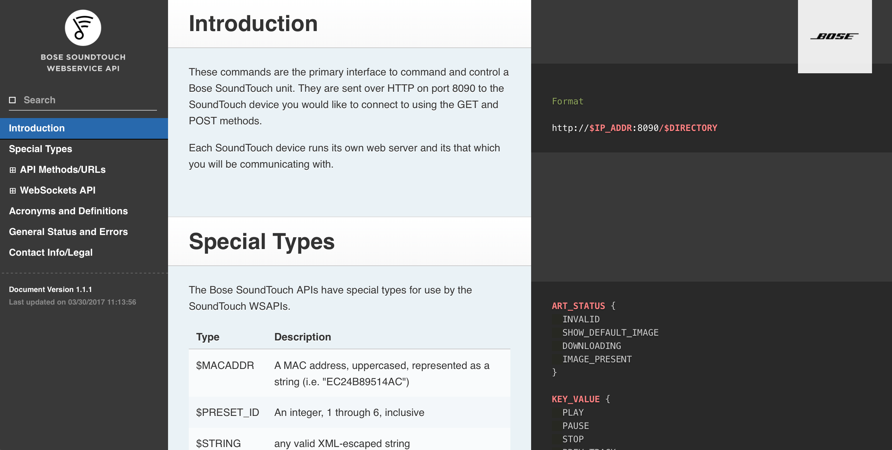

# st_api_docs
An HTML/JavaScript/CSS static site of SoundTouch API documentation (idea).

I put this together simply as an experiment and a potential goal of how a Bose documentation static site might be configured. Stressing sample code in the right column. 

